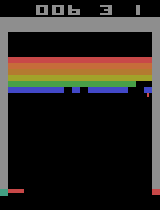

# DRL Experiments

## Description
For my bachelor thesis I want to create more meaningful visualisations of the Deep Reinforcement Learning (DRL) Process. This repository is solely for the use of experiments within DRL.

## Implemented DRL algorithms
- [x] Deep Q Network (DQN) 
- [x] Double Deep Q Network (DDQN)
- [x] Dueling Deep Q Network 
- [ ] Deep Deterministic Policy Gradient
- [ ] A3C
-...

## Deep Q Learning 
The basic DQN implementation is based upon the [original Nature Paper from Mnih et al.](https://www.nature.com/articles/nature14236?wm=book_wap_0005). For the DDQN and the Dueling DQN I used the corresponding papers from [van Hasselt et al.](https://ojs.aaai.org/index.php/AAAI/article/view/10295) and [Wang et al.](http://proceedings.mlr.press/v48/wangf16.html). Further references used for the code, are stated within the comments.

### Agent Example Play

    

## Dependencies
- OpenAI Gym
- Tensorflow (Keras)
- OpenCV

